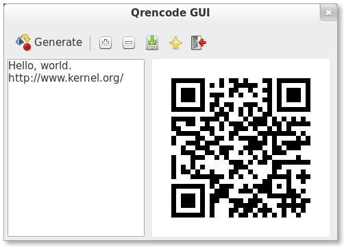

ABOUT
=====
qrencode-gui - QR Image Generator with GUI.

Qrencode-gui is a graphical user interface to generate QR images, using qrencode as a backend.

Tested on Debian sid.

SCREENSHOT
==========

Features
========
* Simple to use.
* Instant QR image generation.

INSTALL
=======
In Debian based systems(like Ubuntu, Linux Mint), just download and install the deb package, `qrencodegui.deb`.

Alternatively, you can build your own deb package, see BUILD part.

RPM packages will be added soon.

BUILD
=====
Enter the build/ folder, and run build.sh script in command user like this:
`$ ./build.sh`

Then, run generate-deb.sh with root priviledge, like this:
`$ sudo ./generate_deb.sh`

TODO
====
* Add rpm package builder.
